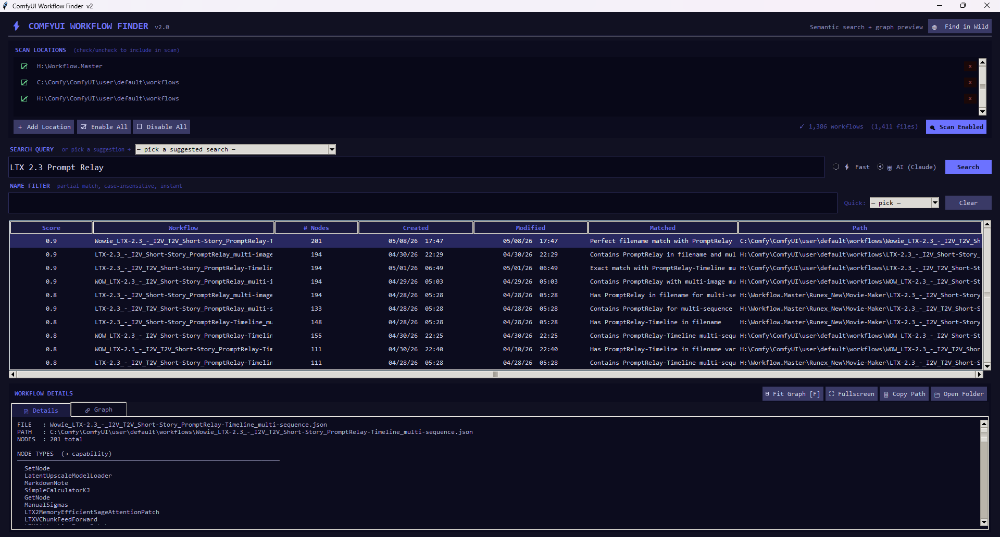
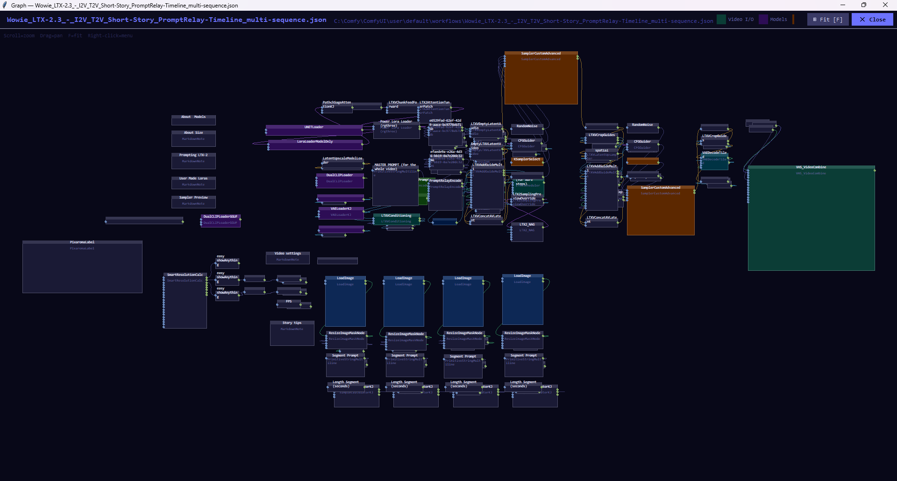
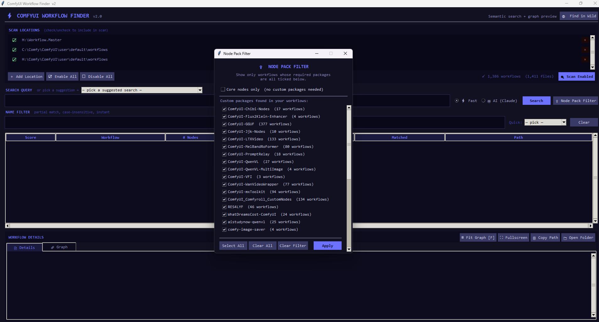
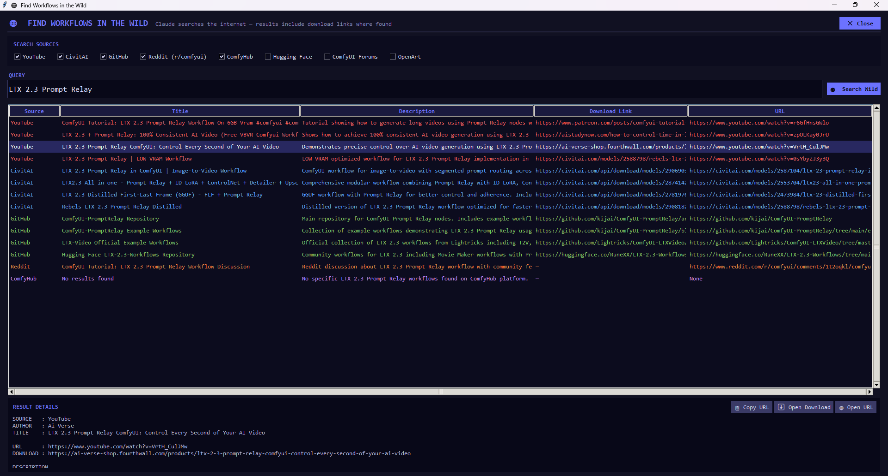

# ⚡ ComfyUI Workflow Finder

A desktop search and preview tool for your local ComfyUI workflow library — plus a live web search to find workflows across YouTube, CivitAI, GitHub, and more.



---

## Features

### Local Search
- **Semantic search** — describe what you want (*"load a video and generate a caption"*) and find matching workflows instantly by node type
- **AI-powered search** — optional Claude API mode for natural language queries that go beyond keyword matching
- **Name filter** — partial match, case-insensitive, live-as-you-type with custom quick-pick dropdown
- **Suggestions dropdown** — 80+ pre-built search phrases across 15 categories, loaded from an editable JSON file
- **Sortable columns** — click any column header to sort ascending/descending
- **Created / Modified dates** — find your most recently worked-on workflows instantly
- **Multiple scan locations** — add as many workflow folders as you have, toggle each on/off
- **Dynamic location toggling** — check or uncheck a location and results update automatically without a full rescan
- **Config persistence** — scan locations and preferences survive restarts

### Graph Preview



- **Node graph preview** — see the actual node layout of any workflow, colour-coded by node type
- **Fullscreen graph popup** — open any workflow graph maximized with a colour legend
- **Zoomable / pannable canvas** — scroll to zoom, drag to pan, F to fit, right-click for menu
- **Bezier wire colouring** — wires coloured by data type (IMAGE, LATENT, MODEL, VIDEO, MASK, etc.)
- **Hover tooltips** — hover any node to see type, title, and slot counts

### Node Pack Filter 🔌



Ever downloaded a workflow from the internet only to find it needs 10 custom node packages you don't have? The Node Pack Filter solves that.

After scanning, the app reads your actual `custom_nodes` folder and detects which packages each workflow in your library requires. Click **🔌 Node Pack Filter** and you get a checklist of every custom node package found across your workflows — with a count of how many workflows use each one.

- **Check only the packages you have installed** → search results only show workflows you can actually run right now
- **Core nodes only** → see workflows that need zero custom packages, straight out of the box
- Works with both Fast and AI search modes




- **Live web search** — Claude searches YouTube, CivitAI, GitHub, Reddit, and ComfyHub in real time
- **Download link detection** — automatically finds direct download links where available
- **Live search indicator** — animated progress panel shows each web search query as Claude fires it
- **Configurable sources** — edit `workflow_finder_sources.json` to add or remove sources

---

## Getting Started

When you first open the app you'll see a welcome dialog walking you through setup. The short version:

**Step 1 — Add your workflow folders**

Click **＋ Add Location** and browse to where ComfyUI saves your workflows. It's usually here:

```
[your ComfyUI install]\user\default\workflows
```

For example:
```
C:\Comfy\ComfyUI\user\default\workflows
H:\Comfy\ComfyUI\user\default\workflows
C:\ComfyUI_windows_portable\ComfyUI\user\default\workflows
```

You can add as many locations as you have ComfyUI installs. Check the box next to each one to include it in scans.

**Step 2 — Scan**

Click **Scan Enabled**. The app indexes every workflow JSON it finds. With 1,000+ workflows this takes a few seconds.

**Step 3 — Search**

Type what you're looking for in plain English and hit Search. No need to remember filenames.

---


- Python 3.10+
- `tkinter` — included with standard Python on Windows
- `anthropic` — needed for AI search mode and Find in the Wild

```powershell
python -m pip install anthropic
```

> **Important — multiple Python versions:** If you have more than one Python installed, make sure you install `anthropic` using the same Python that runs the app. If the AI features say the package isn't found even after installing it, use this instead:
> ```powershell
> & "$(python -c 'import sys; print(sys.executable)')" -m pip install anthropic
> ```
> That installs into whichever Python is actually running your scripts.

---

## Setting up your Anthropic API Key

AI search mode and Find in the Wild both require a free Anthropic API account. Fast mode works without one.

**Step 1 — Create an account**

Go to [console.anthropic.com](https://console.anthropic.com) and sign up. You get free credits to try it out.

**Step 2 — Get your API key**

- Click **API Keys** in the left sidebar
- Click **Create Key**, give it a name (e.g. "Workflow Finder")
- Copy the key — it starts with `sk-ant-`

**Step 3 — Add it to Windows Environment Variables**

1. Press `Win + R`, type `sysdm.cpl`, hit Enter
2. Click **Advanced** → **Environment Variables**
3. Under **User variables**, click **New**
4. Variable name: `ANTHROPIC_API_KEY`
5. Variable value: paste your key
6. Click OK all the way out and restart the app

**Cost:** API usage is pay-per-use and very cheap for this tool — a typical wild search costs fractions of a cent. Set a monthly spending limit at [console.anthropic.com](https://console.anthropic.com) under **Billing** for peace of mind.

---

## Installation

1. Download all files into a folder (e.g. `C:\py\Workflow Finder\`)
2. Run:

```powershell
python workflow_finder.py
```

No installer, no virtual environment needed.

---

## Files

| File | Purpose |
|---|---|
| `workflow_finder.py` | Main application |
| `workflow_finder_queries.json` | Suggested search phrases (auto-created, editable) |
| `workflow_finder_prefixes.json` | Quick name-filter prefixes (auto-created, editable) |
| `workflow_finder_sources.json` | Wild Search sources (auto-created, editable) |
| `workflow_finder_config.json` | Your scan locations — auto-created, **not committed to repo** |

---

## Search Modes

**⚡ Fast** — local keyword matching against a built-in node capability map (~100 node types). Instant, no internet required.

**🤖 AI (Claude)** — sends workflow fingerprints to the Claude API for true semantic matching. Requires an Anthropic API key set in Windows Environment Variables as `ANTHROPIC_API_KEY`.

---

## Find in the Wild

Click **🌐 Find in Wild** in the toolbar. Claude browses real websites in real time and returns:

- Source, Title, Description, Download Link, URL
- Double-click any row to open in your browser
- Right-click for copy options

Edit `workflow_finder_sources.json` to customise which sites are searched:

```json
{
  "sources": [
    {"name": "YouTube",            "enabled": true},
    {"name": "CivitAI",            "enabled": true},
    {"name": "GitHub",             "enabled": true},
    {"name": "Reddit (r/comfyui)", "enabled": true},
    {"name": "ComfyHub",           "enabled": true},
    {"name": "Hugging Face",       "enabled": false}
  ]
}
```

---

## Graph Preview Controls

| Control | Action |
|---|---|
| Scroll wheel | Zoom in / out |
| Left drag | Pan |
| `F` key | Fit to screen |
| Right-click | Context menu |
| Hover | Node tooltip |
| Double-click row | Open in Explorer |

Node colours: teal=video I/O, navy=image I/O, purple=model loaders, orange=samplers, green=CLIP/text, gold=captioning/LLM, magenta=ControlNet, rust=SAM/segment.

---

## Customisation

All JSON config files are auto-created on first run. Edit freely, restart to reload.

**Add search suggestions** — edit `workflow_finder_queries.json`:
```json
{
  "categories": {
    "My Category": ["my custom search phrase"]
  }
}
```

**Add name filter prefixes** — edit `workflow_finder_prefixes.json`:
```json
{
  "prefixes": ["Wow_", "Master_", "Test_", "WIP_", "Flux_", "LTX_"]
}
```

---

## Related

- [ComfyUI Model Scanner](https://github.com/gregowahoo/comfyui-model-scanner) — scan your model library, check which models a workflow needs, copy between drives

---

## License

MIT
